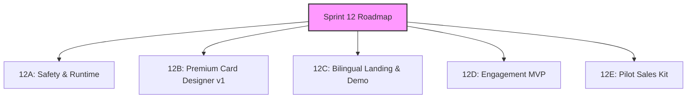

# Sprint 12: Launch Readiness, BTAQA Parity & Market-readiness

**Goal:** Prepare Waflo for the first real restaurant pilot by hardening runtime safety, establishing visual parity with BTAQA, and creating pilot market-readiness onboarding kits, while locking in Waflo's restaurant-first differentiation.

**Status:** Sprint 12A — Staff Scanner E2E: ✅ PASSED (2026-06-25). Remaining items in progress.

---

## Required Sprint 12 Structure

### 1. Sprint 12A — Safety and Runtime

#### A. Fix Unverified Cross-Device Recovery Security
* **Owner:** Person 3 (API/Web)
* **Goal:** Hardens card recovery to prevent unauthorized access when a customer recovers their card on a new device or browser.
* **Acceptance:**
  - [ ] Customer card token recovery requires an verification/OTP fallback or secure proof of ownership (e.g., Clerk-verified session or transient verification code).
  - [ ] Rejects recovery attempts with unverified phone formats.
  - [ ] Logs clean, anonymous audit trails on recovery events without printing raw tokens, public keys, or PII.

#### B. Real Flutter Staff Scanner E2E Smoke
* **Owner:** Person 2 (Flutter)
* **Goal:** Verify that the manual staff scan and stamp workflow functions properly on a real device/emulator with a Clerk-verified staff session.
* **Result:** ✅ PASSED — 2026-06-25
* **Acceptance:**
  - [x] Authenticated staff session (using a valid Clerk token).
  - [x] Staff scans the customer's Apple/Google Wallet QR barcode.
  - [x] App displays details and allows the staff member to tap "Add Stamp".
  - [x] DB stamp count increments by 1.
  - [x] App shows a clean, instant success confirmation dialog.
  - [ ] Friendly errors shown on expired/invalid/unauthorized scans. *(deferred — not tested in this pass)*

> **Environment notes (2026-06-25):**
> - **Device:** Physical Android device (Xiaomi). APK installed manually via file transfer due to Xiaomi USB install restriction.
> - **Flutter/Android SDK:** `sdk.dir` was pointing to `D:\` (incorrect). Fixed by installing a clean Android SDK at `D:\Android\Sdk` and updating `local.properties`.
> - **API URLs:** Mobile app was using localhost URLs. Switched to staging URLs to unblock staff login, business context, and Wallet Scan.
> - **Workflow confirmed:** Staff login → business context load → Wallet Scan open → valid QR scan → Add Stamp → success.

---

### 2. Sprint 12B — Premium Card Designer v1 (BTAQA Parity)

* **Owner:** Person 3 (Backend/Web) + Person 1 (Product UX)
* **Goal:** Give restaurant owners self-service customization of their Wallet passes so their cards look premium and retail-ready.
* **Acceptance:**
  - [ ] **Color Customization:** Owner can select brand colors (background, text, and label accent) via a visual color picker.
  - [ ] **Logo Upload:** Support uploading a transparent PNG logo and rendering it in the header assets of Apple/Google Wallet.
  - [ ] **Icon Selection:** Select standard stamp icon templates (e.g., Star, Cookie, Coffee Cup, Heart, Pizza Slice, Burger, Cupcake).
  - [ ] **Background Presets:** Select from pre-made visual background gradients and surface templates.
  - [ ] **Live Wallet Previews:** Render real-time Apple Wallet pass and Google Wallet pass mockups directly in the designer UI before saving.
  - [ ] **Premium Visual Quality:** Produced designs must look polished and sellable, avoiding plain white/blue developer-demo aesthetics.

---

### 3. Sprint 12C — Bilingual Landing and Demo (BTAQA Parity)

* **Owner:** Person 3 (Frontend Web)
* **Goal:** Create a high-converting public landing page to attract restaurant pilots.
* **Acceptance:**
  - [ ] **Bilingual Toggle:** Clean English and Arabic language translation toggle.
  - [ ] **Features Section:** Clear value proposition highlighting QR menus + Wallet loyalty integrated together.
  - [ ] **How It Works:** Simple 3-step visualization (1. Customer scans table QR, 2. Customer adds Wallet card, 3. Staff adds stamps on scan).
  - [ ] **Pricing Placeholder:** Present tier proposals or localized trial program highlights.
  - [ ] **Demo Card Carousel:** Interactive carousel showcasing premium Apple/Google Wallet mockups.
  - [ ] **FAQ:** Addressing questions on APNs, scanner requirements, hardware compatibility, and costs.
  - [ ] **CTA Forms:** Active pilot signup form linking directly to restaurant onboarding pipelines.

---

### 4. Sprint 12D — Engagement MVP (BTAQA Parity)

* **Owner:** Person 3 (API/Cron Jobs)
* **Goal:** Implement location awareness and basic retention rules to increase customer return rates.
* **Acceptance:**
  - [ ] **Branch Coordinates:** Store physical restaurant branch coordinates (latitude/longitude) in business configuration.
  - [ ] **Apple Wallet Relevance:** Embed relevance coordinates in generated `.pkpass` bundles so the pass lights up on the customer's lock screen when they walk near the restaurant.
  - [ ] **Google Wallet Locations:** Map coordinates/merchant locations into Google Wallet objects where supported.
  - [ ] **Inactive Customer Reminders:** Enqueue background notification/email alerts to customers who haven't visited in 14 days.
  - [ ] **Reward-Ready Alerts:** Send a reminder when a customer is 1 stamp away or has a reward ready to redeem.
  - [ ] **Notification Safety:** Throttle rules to prevent sending more than 1 notification/update per 24 hours per customer.

---

### 5. Sprint 12E — Pilot Sales Kit

* **Owner:** Person 1 (Marketing/Ops)
* **Goal:** Provide materials for physical onboarding and staff training at the pilot restaurant.
* **Acceptance:**
  - [ ] **Printable QR/PDF Kit:** High-quality PDF templates for table stickers, cashier posters, and checkout counters.
  - [ ] **Onboarding Checklist:** 10-step configuration checklist for the onboarding team.
  - [ ] **Staff Training Guide:** 1-page quick reference sheet for cashiers on scanning and adding stamps.
  - [ ] **Owner Demo Script:** Script for sales walk-through showing visual designer, scanner app, and analytics dashboard.
  - [ ] **Go/No-Go Checklist:** The final deployment checklist before launching live customer traffic.

---

## Waflo Differentiation

Waflo is built specifically to address the local restaurant/cafe market, differentiating from BTAQA on:

1. **Restaurant-First Integration:** Combines digital QR dining menus and Wallet loyalty into a single seamless customer experience.
2. **cashier-Friendly Staff Scanner:** Flutter scanner UI optimized specifically for high-speed, busy restaurant cashier counters (minimal taps).
3. **Local Iraq-First Localization:** Localized Arabic/Kurdish translations out-of-the-box, ensuring high conversion rates among local users.
4. **Local Pricing and Support:** Transparent local pricing structures and hand-delivered physical marketing support.

---

## Out of Scope for Sprint 12
* Loyalty v2 (multi-tier rewards, advanced analytics)
* Multi-branch v2
* Global pricing / multiple pricing engines
* AI recommendations
* Custom domains
* Advanced analytics

---

## First Acceptance Gate
Staff scanner E2E smoke must pass before pilot restaurant onboarding begins.
